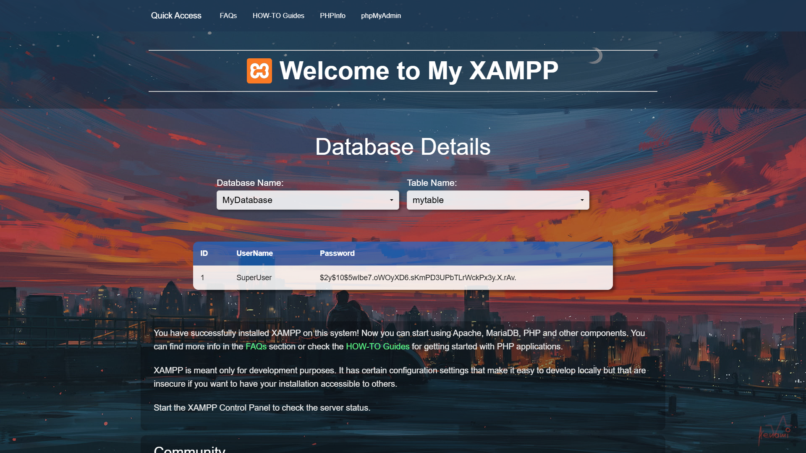
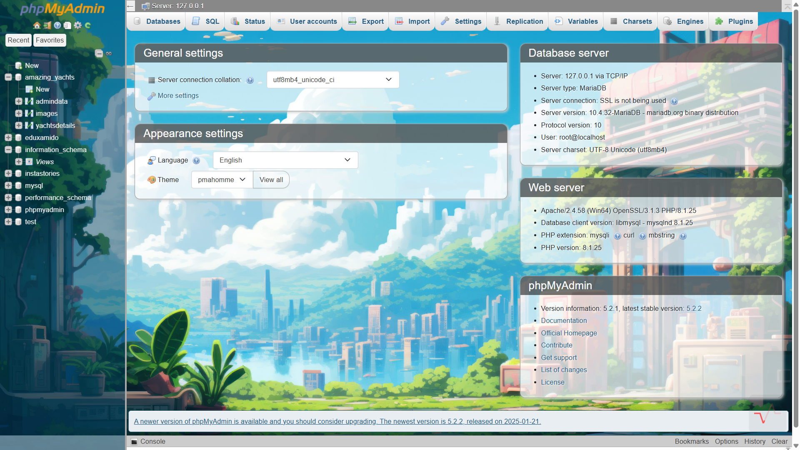

# 🚀 XAMPP Custom phpMyAdmin & Dashboard Designs

A **modernized** and **custom-designed** XAMPP phpMyAdmin interface and dashboard for a better user experience. This project enhances the default phpMyAdmin UI with a sleek, intuitive design and a more user-friendly dashboard layout.

---

## 🌟 Features
✅ Stylish & modern UI for phpMyAdmin  
✅ Custom dashboard design for XAMPP  
✅ Easy to install & configure  
✅ Responsive design for all devices  

---

## 📸 Screenshots
### 🖥️ XAMPP Custom Dashboard


### 🎨 Custom phpMyAdmin UI



---

## 📥 Installation
1. **Clone the repository:**
   ```sh
   git clone https://github.com/mrabhin03/Xampp-Custom-phpMyAdmin-AND-dashboard-designs.git
   ```
2. **Navigate to the project folder:**
   ```sh
   cd Xampp-Custom-phpMyAdmin-AND-dashboard-designs
   ```
3. **Copy the custom files to XAMPP directory:**
   - Replace `phpMyAdmin` folder with the custom UI folder.
   - Update `xampp-control-panel` dashboard files.
4. **Restart Apache & MySQL** in XAMPP and enjoy the new design!

---

## 🛠️ Technologies Used
- HTML, CSS, JavaScript
- Bootstrap for responsive design
- Custom theming for phpMyAdmin

---

## 🎯 Usage
1. Open **phpMyAdmin** in your browser (`http://localhost/phpmyadmin`).
2. Explore the custom interface and themes.
3. Use the new **XAMPP Dashboard** for a better experience.

